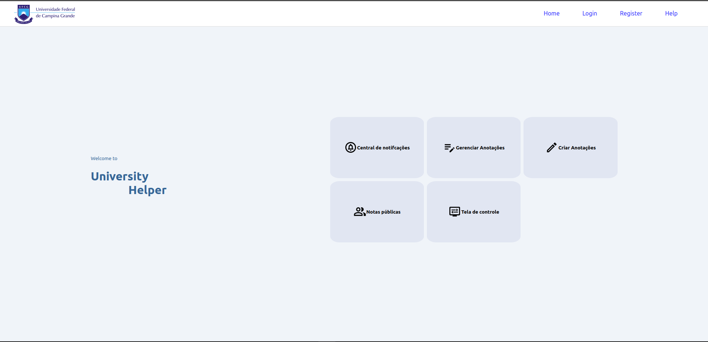
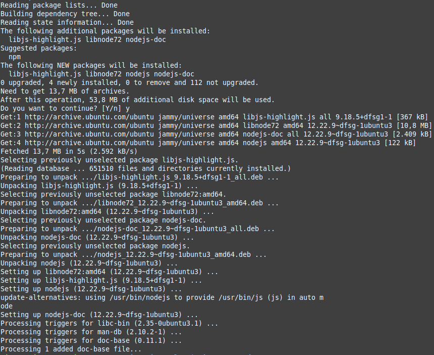
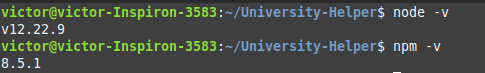
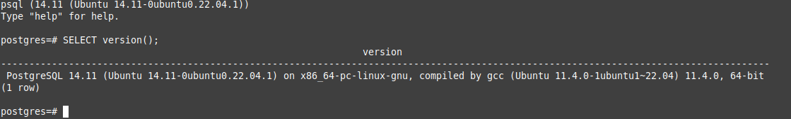
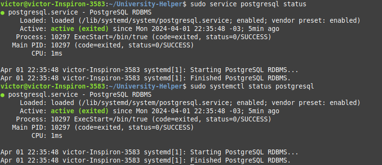
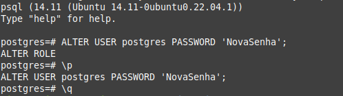
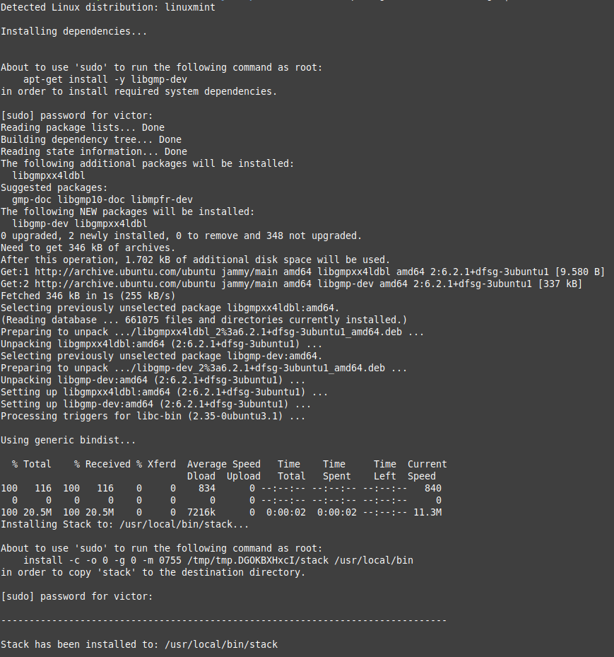

# University Helper

O University Helper, é uma solução desenvolvida por um grupo de alunos da disciplina de PLP, para enfrentar os desafios persistentes do ambiente universitário. Afinal, organizar suas informações, lembretes, anotações, entre outras coisas, exige uma boa organização. Além disso, ter um ambiente de comunicação entre alunos e professores é imprescindível. Então que tal algo mais global?



## Objetivo

Nosso objetivo é transformar a experiência universitária, proporcionando aos estudantes uma plataforma integrada e eficiente que simplifica tarefas, otimiza o tempo e promove um ambiente colaborativo de aprendizado. Com o University Helper, você terá acesso a ferramentas poderosas para gerenciar sua rotina acadêmica, como a criação e compartilhamento de anotações essenciais.

Não deixe que os obstáculos burocráticos e a falta de integração atrapalhem sua jornada acadêmica. Experimente o University Helper e descubra como podemos tornar sua experiência universitária excepcional.

## Configuração da ferramenta em seu dispositivo

Há 3 coisas que você precisa configurar antes de poder desfrutar da nossa ferramenta com total poder, iremos explicar abaixo como manter cada seção funcionando perfeitamente.

### Frontend

Uma boa interface para o usuário é muito importante para que uma ferramenta se mantenha em uso nos dias de hoje, por isso, criamos um frontend como uma casca, não há lógica nele a não ser requisições http para nossa API do University Helper

Sem mais delongas, vamos ao tutorial de instalação.

#### Instalando e configurando o npm

1. Abra o seu terminal e digite o comando abaixo para atualizar o repositório do seu sistema com as mais novas informações sobre os pacotes e suas versões.

    ```bash
    sudo apt update
    ```

2. Após o comando de cima ter sido executado, instale o Node.js com o seguinte comando:

    ```bash
    sudo apt-get install nodejs
    ```

    Confirme a instalação, digitando "y" e pressionando a tecla Enter no terminal. Algo similar a imagem a seguir deve aparecer na sua tela:

    
    [Link para o arquivo de texto da imagem acima](docs/sudo-apt-install-nodejs.txt)

3. Instale também o gerenciador de pacotes do Node.js (npm) executando o seguinte comando:

    ```bash
    sudo apt install npm
    ```

    OBS: Lembre-se de confirmar a instalação!

    [Link para o arquivo de texto com os logs do comando acima](docs/sudo-apt-install-npm.txt)

4. Depois disso, verifique se a instalação do Node.js e do npm com os seguintes comandos:

    ```bash
    node -v
    npm -v
    ```

    Seu terminal deve apresentar as versões dos pacotes instalados de forma similar a imagem abaixo:

    

    Se estiver tudo certo, poderemos seguir para a próxima etapa. Senão, veja mais informações no [site oficial do Node.js](https://nodejs.org/en/learn/getting-started/how-to-install-nodejs).

### BD

O University Helper faz uso do PostgreSQL da máquina local do usuário para a persistência de dados. Portanto, é essencial que ele esteja devidamente configurado na sua máquina.

#### Instalando e configurando o PostgreSQL

1. No terminal, execute o seguinte comando para instalar a versão mais recente disponível do PostgreSQL:

    ```bash
    sudo apt install postgresql postgresql-contrib
    ```

    Confirme a instalação e espere a finalização do comando.

    [Exemplo de logs da execução no terminal](docs/sudo-apt-install-postgresql.txt)

2. Verifique se a instalação do PostgreSQL foi bem sucedida, execute o seguinte comando para entrar no prompt do PostgreSQL:

    ```bash
    sudo -u postgres psql
    ```

    Em seguida, execute:

    ```psql
    SELECT version();
    ```

    Seu terminal deve está parecido com a imagem abaixo:

    

    Depois disso, execute o comando abaixo para sair do prompt do PostgreSQL:

    ```psql
    \q
    ```

3. Utilize qualquer um dos comandos abaixo para verificar o status do serviço PostgreSQL:

    ```bash
    sudo service postgresql status

    sudo systemctl status postgresql
    ```

    Se o PostgreSQL estiver habilitado, sua linha de comando exibirá *active* e *loaded* de maneira similar a imagem a seguir:

    

4. Verifique se o PostgreSQL está pronto para receber conexões com o comando abaixo:

    ```bash
    sudo pg_isready
    ```

    Deve ser exibido na tela o seguinte:

    

    Com isso, a instalação do PostgreSQL foi realizada com sucesso.

5. Certifique-se de instalar as bibliotecas e os cabeçalhos para desenvolvimento:

    ```bash
    sudo apt-get install libpq-dev
    ```

6. Por fim, para utilizar o University Helper, será necessário configurar o arquivo no caminho backend/config.yaml:

    Exemplo do arquivo config.yaml na nossa aplicação:

    ```yaml
    db_host: "localhost"
    db_port: 5432
    db_name: "postgres"
    db_user: "postgres"
    db_password: "<change_me>"
    ```

    Caso você tenha seguido esse tutorial será necessário apenas trocar o campo *db_password*, visto que a instalação do PostgreSQL cria um usuário chamado postgres e um banco de dados com o mesmo nome. Caso contrário, modifique o arquivo de acordo com suas configurações.

    Se, por acaso, você não lembra a sua senha, siga o passo-a-passo abaixo:

    1. Entre no prompt de comando do PostgreSQL

        ```bash
        sudo -u postgres psql

    2. Execute o comando abaixo, substituindo a palavra *NovaSenha* pela senha desejada:

        ```psql
        ALTER USER postgres PASSWORD 'NovaSenha';
        ```

        Verifique a alteração e saia do prompt com os comandos:

        ```psql
        \p

        \q
        ```

        Seu terminal deve apresentar algo similar a imagem abaixo:

        

    3. Reinicie o serviço do PostgreSQL usando este comando:

        ```bash
        sudo service postgresql restart
        ```

        Pronto, agora pode colocar sua nova senha no campo *db_password* do arquivo config.yaml.

    Parabéns, finalizamos esse tutorial de instalação! Agora, vamos para o próximo (e último) passo. Caso não tenha dado certo, visite o [site oficial do PostgreSQL](https://www.postgresql.org/download/) e utilize [esse artigo como guia](https://geekflare.com/postgresql-installation-guide/).

    Essa parte é muito importante, pois se as dependências do PostgreSQL não forem instaladas corretamente, a API Haskell não funcionará.

### API Haskell

O University Helper possui uma API em Haskell para lidar com as requisições do usuário. Para executá-la é necessário que a ferramenta, [Haskell Tool Stack](https://docs.haskellstack.org/en/stable/), esteja devidamente instalada.

#### Instalando e configurando a Stack

1. Instale a ferramenta com o seguinte comando:

    ```bash
    curl -sSL https://get.haskellstack.org/ | sh
    ```

    Seu terminal deve apresentar mensagens de logs semelhantes à imagem abaixo:

    

    [Link para o arquivo de texto com os logs do comando acima](docs/sudo-installing-stack.txt)

2. Certifique-se de que seu sistema possui a última versão da Stack com o comando:

    ```bash
    stack upgrade
    ```

    E é isso! A ferramenta está corretamente instalada no seu programa. Caso não tenha dado certo, visite a [documentação oficial da Stack](https://docs.haskellstack.org/en/stable/).

### Executando a aplicação

#### Executando a API Haskell

1. Em um terminal, navegue para a raíz do projeto University Helper, utilizando o seguinte comando e lembrando de substituir *path/To/UniversityHelper* com o caminho correto:

    ```bash
    cd path/To/UniversityHelper
    ```

2. Instale as dependências do projeto com a Stack, executando:

    ```bash
    stack install
    ```

3. Certifique-se de que o arquivo no caminho *backend/config.yaml* esteja configurado corretamente como mencionado acima.

4. Gere o executável do projeto e execute-o com a Stack, utilizando o comando:

    ```bash
    stack run
    ```

    Com isso, a API Haskell estará rodando em plano de fundo.

#### Executando o front-end React

1. Em outro terminal, navegue para a pasta *frontend/* dentro da raíz do projeto, usando algo similar ao comando abaixo:

    ```bash
    cd pathToUniversityHelper/frontend
    ```

2. Instale as dependências do projeto com o NPM, executando:

    ```bash
    npm install
    ```

3. Execute a interface do usuário com o seguinte comando:

    ```bash
    npm start
    ```

    Espere até que abra uma nova página na web, caso isso não aconteça e o servidor já tenha subido, acesse o [localhost](localhost:3000).